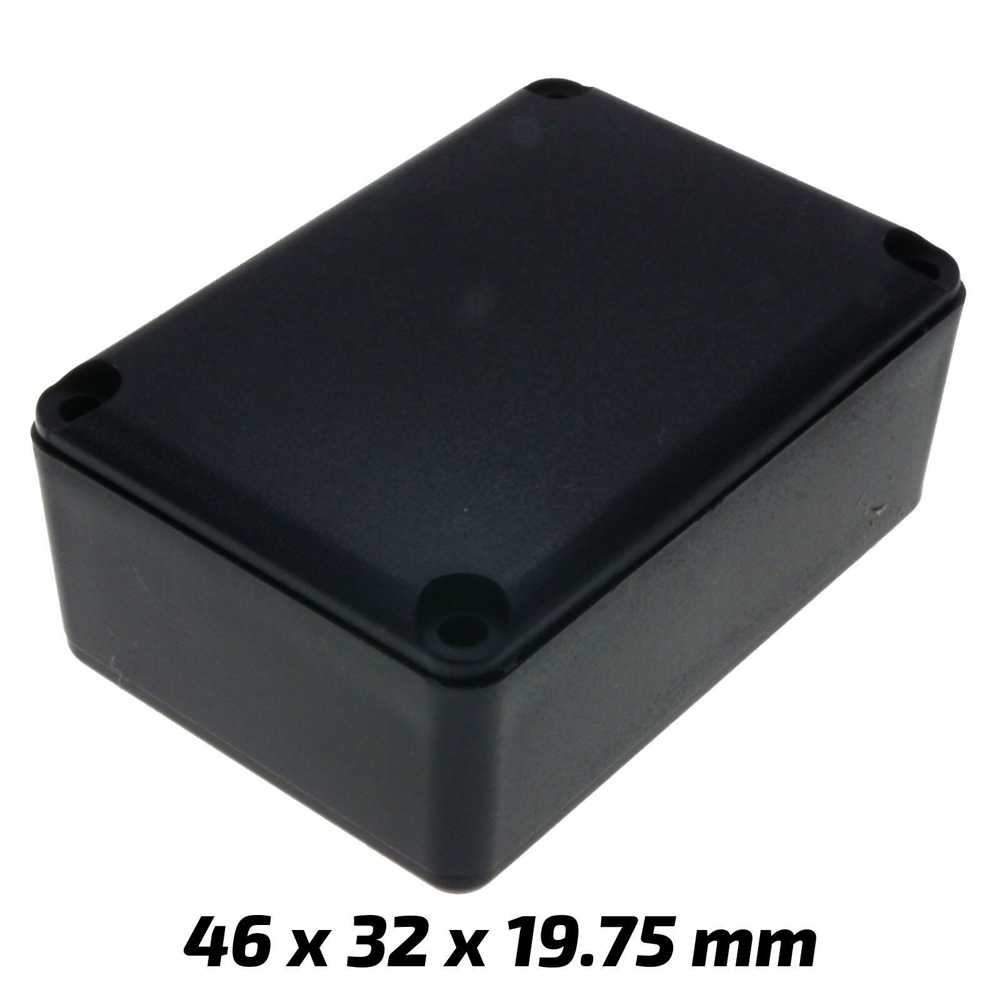
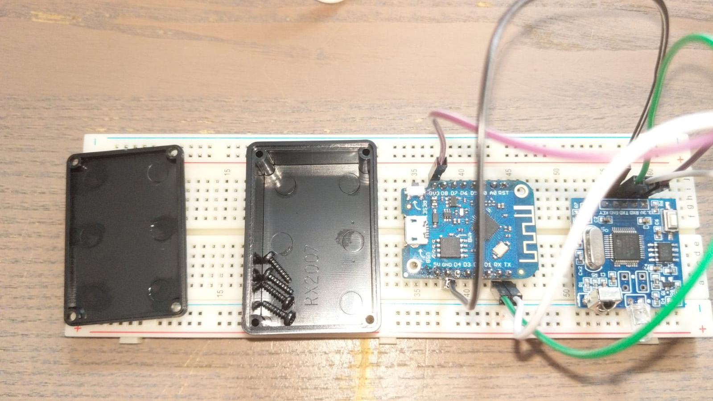
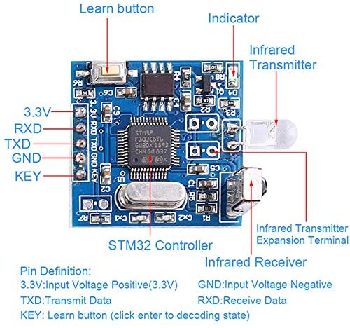
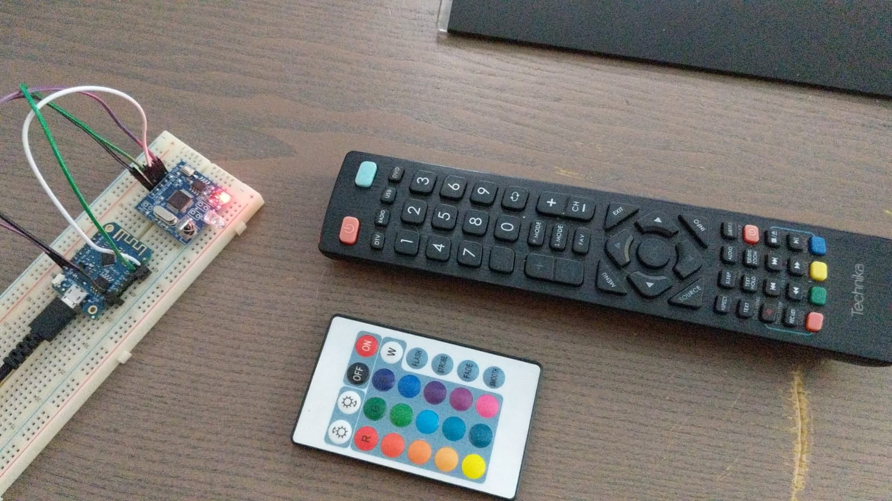
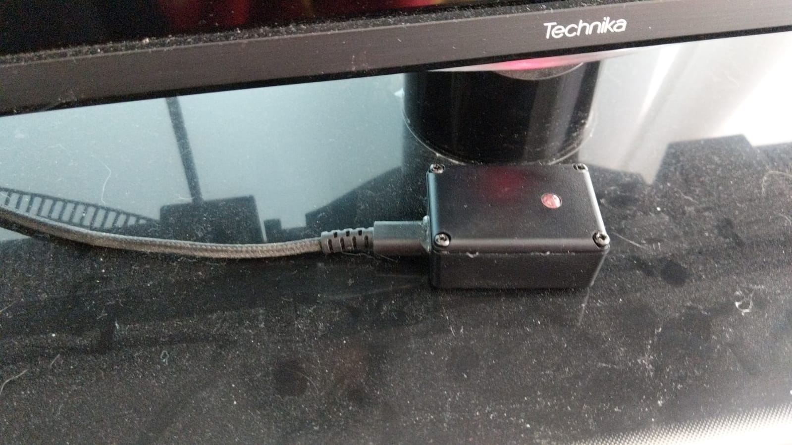
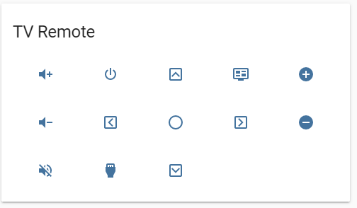

# ESPHome IR Remote Control

I recently decided it would be a fun idea to try making an IR transmitter which could control my TV with commands sent to it from [Home Assistant](https://www.home-assistant.io/). This of course means I would need to be able to decide my existing IR remote control. I've seen several tutorials on how to do this with arduino and using IR diodes and LEDs but I figured since there can be a lot of variation in the transmission band the IR pulses use it might end up being a lot of work to build a circuit from scratch. That's what I found [this](https://www.amazon.co.uk/gp/product/B08311FVN7/ref=ppx_yo_dt_b_asin_title_o08_s00?ie=UTF8&psc=1) product on amazon. It seems like just what I was looking for, it could handle all the tricky part of encoding and decoding signals and communicate over a simple UART. Well simple and easy turned out to be the wrong word for this project. Mainly because there is almost no help what so ever on the internet for this device which as far as I can tell doesn't even have a name or brand. However when you search for 'General Infrared Decoding Module UART Controller IR Remote Copyer Support Air Conditioning' you do find the same thing being sold else where. My reason them for writing this document is to hopefully make this process easier for the next person. This is a very useful and easy to use little bit of kit if only you know how to use it.

## The Components 

For my system I selected the following components

- [Home Assistant](https://www.home-assistant.io/)
- [General Infrared Decoding Module](https://www.amazon.co.uk/gp/product/B08311FVN7/ref=ppx_yo_dt_b_asin_title_o08_s00?ie=UTF8&psc=1)
- [ESPHome](https://esphome.io/)
- [Wemos D1 Mini](https://docs.wemos.cc/en/latest/d1/d1_mini.html)
- [Small Plastic Enclosure](https://www.ebay.co.uk/itm/ABS-Plastic-Box-for-Electronics-Hobby-Projects-Enclosure-Case-ALL-Sizes-UK/121941168040?ssPageName=STRK%3AMEBIDX%3AIT&var=420931609119&_trksid=p2057872.m2749.l2649)

    

**Note**: This is exactly the right size for the decoder and the Wemos. It's a very very tight squeeze, don't go any smaller. 

## Setup

The basic setup is that the Wemos will connect to Home Assistant thought it's API and this allow Home Assistant to control the IR decoder. The IR decoder will be connected to the Wemos with 4 wires as show below. 



### Wiring (Wemos -> IR Decoder)

- **Purple**: 3.3v -> VCC
- **Black**: GND -> GND
- **Green**: Rx -> Tx 
- **White**: Tx -> Rx

The Receive (Rx) and Transmit (Tx) lines need to be crossed in this way to the devices can transmit to each other's receiver pins. 

**Note**: The diagram (shown later in this guide) claims you can put the decoder into decoding mode using the KEY pin, however I tried pulling this pin low and high and neither changed the mode of the decoder. Maybe I had it setup wrong. 

## ESP Home

Now that you've got the hard ware setup you need to power up the Wemos with a USB cable to flash it via ESP Home. There are very good tutorials on YouTube for this so I won't cover that here. 

The important parts of the yaml in ESP Home that you'll need as below. The full yaml is [here](esphome.yaml)

```yaml
esphome:
  name: ir_blaster
  platform: ESP8266
  board: d1_mini
# You need to include a custom c++ file which is provided below
includes:
    - ir_blaster.h
```

This tells ESP Home to load the code in [`ir_blaster.h`](ir_blaster.h); You'll also need to make sure this file is in the config directory of ESP Home. For me (ESP Home is running in a docker container as an add on to Home Assistant) it's in `~/hassio-config/esphome`. 

Now you need to tell ESP Home to enable the UART on the board. 

```yaml
uart:
  id: uart_bus
  tx_pin: TX
  rx_pin: RX
  baud_rate: 9600
```

Now we need to create a custom sensor to read the input when we are decoding.

```yaml
text_sensor:
- platform: custom
  lambda: |-
    auto ir_sensor = new IRSensor(id(uart_bus));
    App.register_component(ir_sensor);
    return {ir_sensor};
```

This creates a new instance of the class we've defied in `ir_blaster.h` and uses it as the sensor. If you look at the code in `ir_blaster.h` you'll see that it's simply reading 236 bytes of data from the UART input and them dumping them out to the log out put (which in this case will be output on the ESP Home log) in sections of 16 bytes. This makes it easier to copy them and format them in a text editor for pasting back into your yaml file. 

That's all you need to get started decoding. 

## Decoding

Now you can press the little button on the decoder (as show in the diagram below) to put it into learning mode and aim an IR remote at it and press a button. 



Wait a couple of seconds and the code will be output as a bunch of bytes in the ESP Home log. 

There are how ever a couple of very important notes as this point which need to be kept in mind. 

1. **Missing Chunks**: You will notice that in my code to output there are several chunks missing. Specifically I, J, K and L. This is because they were (in my testing always just 4 lines of 16 `0x0`. It didn't hurt having them there but on the Wemos D1 Mini it tended to cause buffer over flows and made the device reboot so I've left them out). It's very easy to put them back int, just copy the line above and change the indexes of the bytes accordingly. 
2. **Always 236 byte**: You will notice that the decoder always outputs 236 bytes no matter what you're decoding. You aren't actually getting the code the remote control sends to the TV but rather you're getting it along with a bunch of other information such as the frequency encoded into 236 bytes. The vary majority of which will be 0x0 as they are not needed. 
3. **Start and End Bytes**: A well formed message will always start with `0xfd, 0xfd` and always ends with `0xdf, 0xdf`. 
4. **0xFF, 0xFF, 0xFF Is Not Bad**: I found some very information about this device on a chinese website which was selling it stating that if the decoded message contained more than three `0xff` bytes in a row that it was probabyl a bad decoding. This isn't true. Most of my decoding's have lots of `0xff`s in them and they work perfectly. 



## Making Switch

Now that you've got a code you can start to do something with it. To get the code into a format that ESP Home can understand you simply need to copy the output into a text editor and join all the block together (don't forget to add in the missing 4 block of 16 0x0) and make one long 236 byte array like this.

`[0xfd, 0xfd, 0x30, 0x3, 0xff, 0x0, 0x0, 0x34, 0x7, 0x0, 0x5d, 0x2, 0x8, 0x0, 0xc, 0x0, 0xb6, 0x0, 0xc, 0x0, 0x7, 0x0, 0x28, 0x0, 0x7, 0x0, 0x3f, 0x0, 0x7, 0x0, 0x3e, 0x0, 0x7, 0x0, 0x3e, 0x0, 0x7, 0x0, 0x3f, 0x0, 0x1, 0x11, 0x23, 0x45, 0x46, 0x74, 0x0, 0x0, 0x0, 0x0, 0x0, 0x0, 0x0, 0x0, 0x0, 0x0, 0x0, 0x0, 0x0, 0x0, 0x0, 0x0, 0x0, 0x0, 0x0, 0x0, 0x0, 0x0, 0x0, 0x0, 0x0, 0x0, 0x0, 0x0, 0x0, 0x0, 0x0, 0x0, 0x0, 0x0, 0x0, 0x0, 0x0, 0x0, 0x0, 0x0, 0x0, 0x0, 0x0, 0x0, 0x0, 0x0, 0x0, 0x0, 0x0, 0x0, 0x0, 0x0, 0x0, 0x0, 0x0, 0x0, 0x0, 0x0, 0x0, 0x0, 0x0, 0x0, 0x0, 0x0, 0x0, 0x0, 0x0, 0x0, 0x0, 0x0, 0x0, 0x0, 0x0, 0x0, 0x0, 0x0, 0x0, 0x0, 0x0, 0x0, 0x0, 0x0, 0x0, 0x0, 0x0, 0x0, 0x0, 0x0, 0x0, 0x0, 0x0, 0x0, 0x0, 0x0, 0x0, 0x0, 0x0, 0x0, 0x0, 0x0, 0x0, 0x0, 0x0, 0x0, 0x0, 0x0, 0x0, 0x0, 0x0, 0x0, 0x0, 0x0, 0x0, 0x0, 0x0, 0x0, 0x0, 0x0, 0x0, 0x0, 0x0, 0x0, 0x0, 0x0, 0x0, 0x0, 0x0, 0x0, 0x0, 0x0, 0x0, 0x0, 0x0, 0x0, 0x0, 0x0, 0x0, 0x0, 0x0, 0x0, 0x0, 0x0, 0x0, 0x0, 0x0, 0x0, 0x0, 0x0, 0x0, 0x0, 0x0, 0x0, 0x0, 0x0, 0x0, 0x0, 0x0, 0x0, 0x0, 0x0, 0x0, 0x0, 0x0, 0x0, 0x0, 0x0, 0x0, 0x0, 0x0, 0x0, 0x0, 0x0, 0x0, 0x0, 0x0, 0x0, 0x0, 0x0, 0x0, 0x0, 0x0, 0x0, 0x0, 0x0, 0x0, 0x76, 0x1, 0xfe, 0xdf, 0xdf]`

Now you can make a UART switch in ESP Home like this. 

```yaml
  - platform: uart
    name: "Wicket Clock Off"
    data: [0xfd, 0xfd, 0x30, 0x3, 0xff, 0x0, 0x0, 0x34, 0x7, 0x0, 0x5d, 0x2, 0x8, 0x0, 0xc, 0x0, 0xb6, 0x0, 0xc, 0x0, 0x7, 0x0, 0x28, 0x0, 0x7, 0x0, 0x3f, 0x0, 0x7, 0x0, 0x3e, 0x0, 0x7, 0x0, 0x3e, 0x0, 0x7, 0x0, 0x3f, 0x0, 0x1, 0x11, 0x23, 0x45, 0x46, 0x74, 0x0, 0x0, 0x0, 0x0, 0x0, 0x0, 0x0, 0x0, 0x0, 0x0, 0x0, 0x0, 0x0, 0x0, 0x0, 0x0, 0x0, 0x0, 0x0, 0x0, 0x0, 0x0, 0x0, 0x0, 0x0, 0x0, 0x0, 0x0, 0x0, 0x0, 0x0, 0x0, 0x0, 0x0, 0x0, 0x0, 0x0, 0x0, 0x0, 0x0, 0x0, 0x0, 0x0, 0x0, 0x0, 0x0, 0x0, 0x0, 0x0, 0x0, 0x0, 0x0, 0x0, 0x0, 0x0, 0x0, 0x0, 0x0, 0x0, 0x0, 0x0, 0x0, 0x0, 0x0, 0x0, 0x0, 0x0, 0x0, 0x0, 0x0, 0x0, 0x0, 0x0, 0x0, 0x0, 0x0, 0x0, 0x0, 0x0, 0x0, 0x0, 0x0, 0x0, 0x0, 0x0, 0x0, 0x0, 0x0, 0x0, 0x0, 0x0, 0x0, 0x0, 0x0, 0x0, 0x0, 0x0, 0x0, 0x0, 0x0, 0x0, 0x0, 0x0, 0x0, 0x0, 0x0, 0x0, 0x0, 0x0, 0x0, 0x0, 0x0, 0x0, 0x0, 0x0, 0x0, 0x0, 0x0, 0x0, 0x0, 0x0, 0x0, 0x0, 0x0, 0x0, 0x0, 0x0, 0x0, 0x0, 0x0, 0x0, 0x0, 0x0, 0x0, 0x0, 0x0, 0x0, 0x0, 0x0, 0x0, 0x0, 0x0, 0x0, 0x0, 0x0, 0x0, 0x0, 0x0, 0x0, 0x0, 0x0, 0x0, 0x0, 0x0, 0x0, 0x0, 0x0, 0x0, 0x0, 0x0, 0x0, 0x0, 0x0, 0x0, 0x0, 0x0, 0x0, 0x0, 0x0, 0x0, 0x0, 0x0, 0x0, 0x0, 0x0, 0x0, 0x0, 0x0, 0x0, 0x0, 0x0, 0x0, 0x0, 0x0, 0x0, 0x76, 0x1, 0xfe, 0xdf, 0xdf]
```

Annoyingly ESP Home dumps out the contents of this to the UART when you send it so when you're ready to have this device working as just a transmitter it's probably easier to remove the sensor part or at least comment it out. 

ESP Home should have added a new switch device in Home Assistant using it's API and you should be able to control this switch with Home Assistant. 

## Finish Touches

My final touch was to put the Decoder and the Wemos in a tiny little plastic enclosure I got on eBay and sit it next to my TVs IR receiver. 



I made a small card for Home Assistant which has all the buttons I decoded programed into it which looks like this.



The lovelace yaml for this card is as follows. 

```yaml
- type: glance
        show_icon: true
        show_name: false
        show_state: false
        title: TV Remote
        entities:
            # 1
          - entity: switch.tv_volume_up
            icon: 'mdi:volume-plus'
            tap_action:
              action: toggle
            # 2
          - entity: switch.tv_on
            icon: 'mdi:power'
            tap_action: 
              action: toggle
            # 3
          - entity: switch.tv_up
            icon: 'mdi:chevron-up-box-outline'
            tap_action:
              action: toggle
            # 4
          - entity: switch.tv_guide
            icon: 'mdi:television-guide'
            tap_action:
              action: 
            # 5
          - entity: switch.tv_channel_up
            icon: 'mdi:plus-circle'
            tap_action:
             action: toggle
            # 6
          - entity: switch.tv_volume_down
            icon: 'mdi:volume-minus'
            tap_action:
              action: toggle
            # 7
          - entity: switch.tv_left
            icon: 'mdi:chevron-left-box-outline'
            tap_action:
              action: toggle
            # 8
          - entity: switch.tv_ok
            icon: 'mdi:checkbox-blank-circle-outline'
            tap_action:
              action: toggle
            # 9
          - entity: switch.tv_right
            icon: 'mdi:chevron-right-box-outline'
            tap_action:
              action: toggle
            # 10
          - entity: switch.tv_channel_down
            icon: 'mdi:minus-circle'
            tap_action:
              action: toggle
            # 11
          - entity: switch.tv_mute
            icon: 'mdi:volume-off'
            tap_action:
              action: toggle
            # 12
          - entity: switch.tv_source
            icon: 'mdi:video-input-hdmi'
            tap_action:
              action: toggle
            # 13
          - entity: switch.tv_down
            icon: 'mdi:chevron-down-box-outline'
            tap_action:
              action: toggle
```

